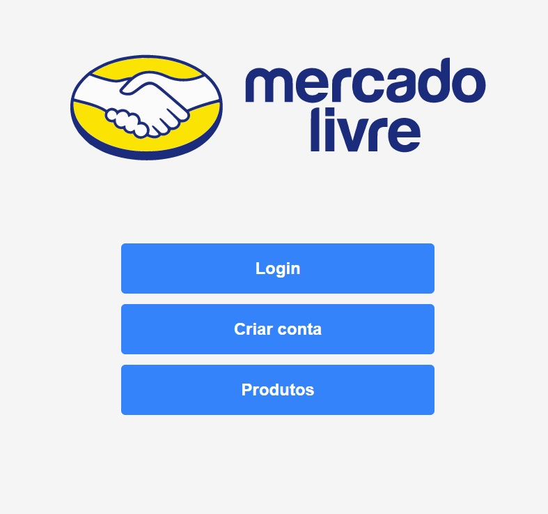

# trabalho1-dso2

INE5612-04238A (20192) - Desenvolvimento de Sistemas Orientados a Objetos II

# Para rodar o backend da aplicação:

yarn dev
onde "dev" é o script criado no arquivo package.json

# Para rodar o frontend da aplicação:

yarn start

# rotas

(ok) cadastrar usuario
(ok) autenticação de login
(ok) lista produtos de usuario especifico
(ok) cadastro de produto n funciona

# Problemas

front cadastro produtos

css da listagem de produtos

css das outras paginas

mostrar produtos na home

achar no video backend para que serve o cors

# Extra

Fazer token de autenticação se der tempo a partir de 6:30

https://www.youtube.com/watch?v=KKTX1l3sZGk
