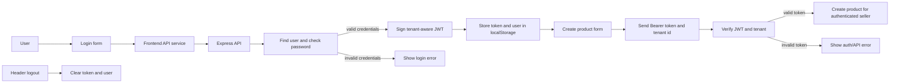
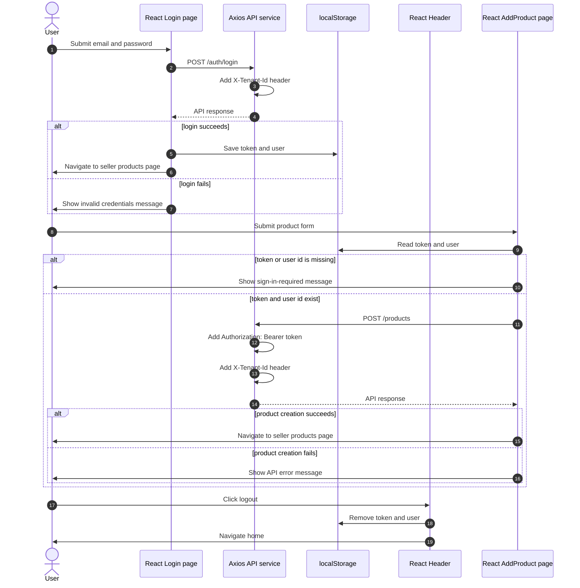
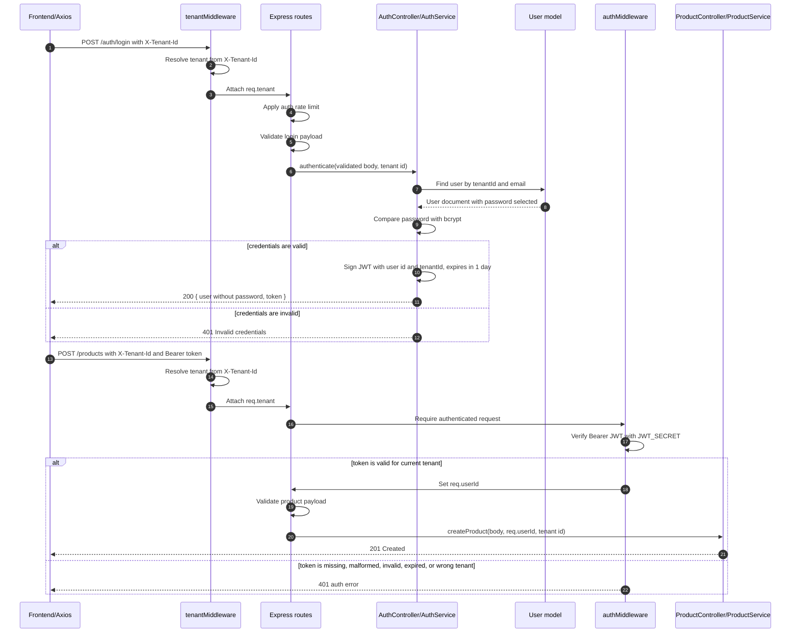

# Authentication Flow

These diagrams show how MercadoZetta authenticates users and reuses the JWT for
protected product creation. The flow is split between frontend and backend to
keep each diagram readable.

## High-Level Flow

## Frontend Flow

## Backend Flow

## Code Map

- Frontend login: `frontend/src/pages/Login.tsx`
- API request headers: `frontend/src/services/api.ts`
- Stored auth state and logout UI: `frontend/src/pages/header/index.tsx`
- Product creation auth check: `frontend/src/pages/AddProduct.tsx`
- Request tenant resolution: `backend/src/middleware/tenant.ts`
- Auth and protected routes: `backend/src/routes.ts`
- Login controller/service: `backend/src/controller/authController.ts` and `backend/src/services/authService.ts`
- JWT verification middleware: `backend/src/middleware/auth.ts`
- Authenticated product creation: `backend/src/controller/productController.ts`
