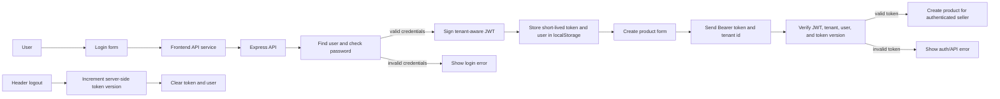
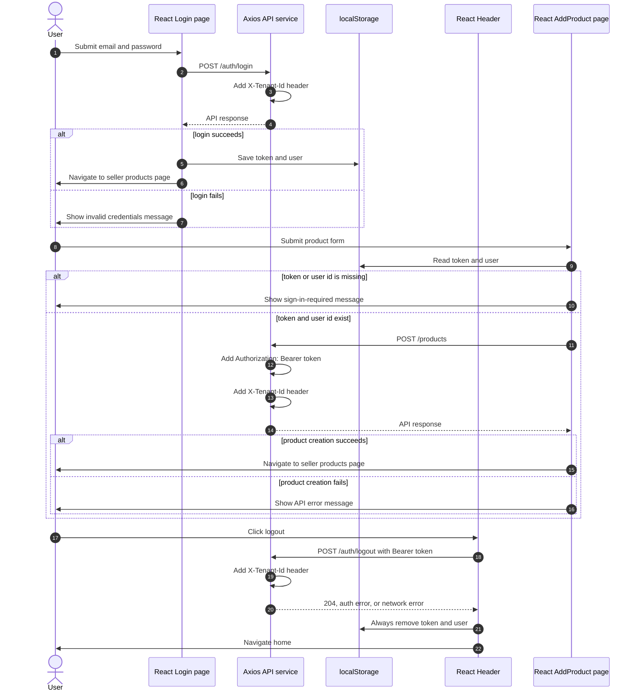
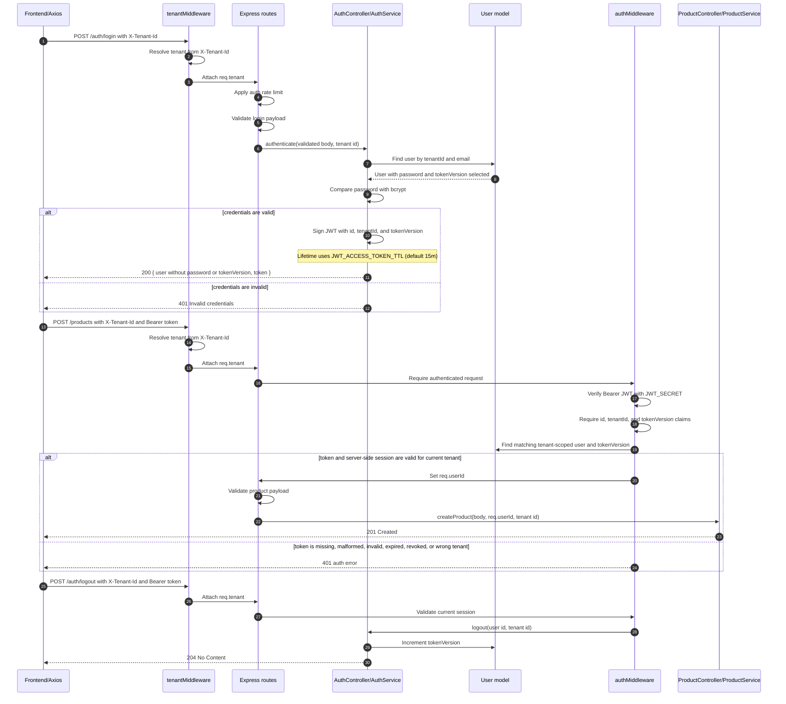

# Authentication Flow

These diagrams show how MercadoZetta authenticates users, validates the
tenant-bound session, revokes access tokens on logout, and reuses the JWT for
protected product creation. The flow is split between frontend and backend to
keep each diagram readable.

## High-Level Flow

## Frontend Flow

## Backend Flow

## Tenant Resolution

`tenantMiddleware` runs before every route. `TENANT_HEADER_REQUIRED` controls
whether requests without `X-Tenant-Id` are rejected. It defaults to `false` in
development and tests and `true` in production. When the header is optional,
requests without it use the default MercadoZetta tenant. Because the middleware
is global, strict mode currently also requires the header on public, health,
and readiness requests.

## Session Model

- Access tokens are stored in `localStorage` and sent as Bearer tokens. This is
  intentionally simple for the demo; the README records the XSS tradeoff and a
  possible future move to secure cookies.
- Every newly issued token contains the user id, tenant id, and the user's
  current `tokenVersion`.
- Protected requests verify both the JWT and a matching user record in MongoDB.
- Logout increments `tokenVersion`, invalidating every previously issued token
  for that user in the tenant. The frontend clears its local auth state even if
  the logout request fails.
- Users created before `tokenVersion` existed are treated as version `0` for
  backward compatibility.

## Code Map

- Frontend login: `frontend/src/pages/Login.tsx`
- API request headers: `frontend/src/services/api.ts`
- Stored auth state and logout UI: `frontend/src/pages/header/index.tsx`
- Product creation auth check: `frontend/src/pages/AddProduct.tsx`
- Request tenant resolution: `backend/src/middleware/tenant.ts`
- Auth and protected routes: `backend/src/routes.ts`
- Login controller/service: `backend/src/controller/authController.ts` and `backend/src/services/authService.ts`
- Security configuration: `backend/src/config/security.ts`
- JWT verification middleware: `backend/src/middleware/auth.ts`
- Authenticated product creation: `backend/src/controller/productController.ts`
