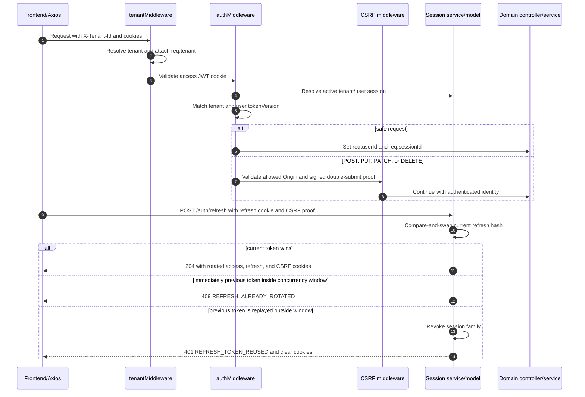

# Authentication Flow

This document describes the current cookie-based browser authentication flow.
The accepted security contract and migration sequence are defined in
[ADR 0001: Cookie-Based Authentication and Rotating Sessions](decisions/0001-cookie-sessions.md).
The backend accepts browser authentication only through the access cookie and
login returns no token field. The React application never reads, stores, or
sends authentication credentials itself.

## High-Level Flow

```mermaid
flowchart LR
    User[User] --> Login[Login form]
    Login --> Api[Credentialed Axios service]
    Api --> Backend[Express API]
    Backend --> UserCheck[Verify tenant user and password]

    UserCheck -->|valid| Session[Create rotating session family]
    Session --> Cookies[Set access, refresh, and CSRF cookies]
    Cookies --> Memory[Keep public user profile in React memory]

    Memory --> Mutation[Authenticated mutation]
    Mutation --> Proof[Send cookies, tenant id, and CSRF proof]
    Proof --> Verify[Verify JWT, session, tenant, user, Origin, and CSRF]

    Verify -->|expired access cookie| Refresh[Atomically rotate refresh token]
    Refresh --> Retry[Retry original request once]
    Verify -->|valid| Action[Perform authorized action]
    Verify -->|renewal fails| Anonymous[Clear in-memory identity]

    Logout[Header logout] --> Revoke[Revoke all user sessions]
    Revoke --> Anonymous
```



## Frontend Flow

```mermaid
sequenceDiagram
    autonumber
    actor User
    participant Auth as React AuthProvider
    participant Api as Axios API service
    participant Backend as Express API
    participant Guard as Protected route

    Auth->>Api: GET /auth/session with credentials
    alt access cookie is active
        Api-->>Auth: Public user and session metadata
        Auth->>Auth: Keep user in memory
    else access cookie expired and refresh cookie is active
        Api->>Backend: POST /auth/refresh with CSRF proof
        Backend-->>Api: 204 and rotated cookies
        Api->>Backend: Retry GET /auth/session once
        Backend-->>Auth: Public user and session metadata
    else session cannot be renewed
        Auth->>Auth: Become anonymous
    end

    User->>Api: POST /auth/login with credentials
    Api-->>Auth: Public user and session metadata; cookies set by browser
    Auth->>Auth: Keep public user in memory
    Auth->>Guard: Continue to requested destination

    User->>Api: Submit an authenticated mutation
    Api->>Api: Add X-Tenant-Id and X-CSRF-Token
    Api->>Backend: Send request with cookies
    alt access cookie expired
        Api->>Backend: One shared POST /auth/refresh
        Backend-->>Api: 204 and rotated cookies
        Api->>Backend: Retry original request once
    end

    User->>Api: POST /auth/logout
    Api-->>Auth: 204, auth error, or network error
    Auth->>Auth: Always clear in-memory identity
```

The Axios layer uses one in-flight refresh promise per tab. When available,
`BroadcastChannel` communicates refresh start and completion between tabs. A
`409 REFRESH_ALREADY_ROTATED` response waits briefly and retries refresh once
with the successor cookie installed by the winning response. Login, refresh,
and an already retried request are never recursively renewed.

## Backend Flow



## Tenant and Session Rules

- `tenantMiddleware` runs before every route. `TENANT_HEADER_REQUIRED` defaults
  to `false` locally and `true` in production.
- The frontend stores no authentication token or user profile in
  `localStorage`; the browser owns the cookies and React holds only the public
  user profile in memory.
- Login creates a tenant/user-scoped session and sets a short-lived access
  cookie, an `HttpOnly` rotating refresh cookie, and a readable session-bound
  CSRF proof.
- Access cookies carry the active configured signing-key `kid`; verification
  selects only retained local keys. Refresh hashes persist their secret version,
  and CSRF proofs encode theirs so deployments can overlap old and new secrets.
- Refresh persistence contains only keyed hashes, uses atomic rotation, applies
  idle and absolute expiry, and revokes the family after detected replay.
- Every cookie-authenticated mutation requires an allowed Origin and matching
  signed CSRF proof. Credentialed CORS uses an explicit origin allowlist.
- Logout increments `tokenVersion`, revokes all active sessions for the
  tenant/user, clears cookies, and clears frontend identity even if the request
  fails.
- Authorization headers are not accepted as authentication, and authenticated
  mutations always pass the Origin and CSRF checks.

## Code Map

- Frontend in-memory auth: `frontend/src/auth/AuthProvider.tsx`
- Frontend credential, CSRF, and renewal transport: `frontend/src/services/api.ts`
- Login and logout UI: `frontend/src/pages/Login.tsx` and
  `frontend/src/pages/header/index.tsx`
- Request tenant resolution: `backend/src/middleware/tenant.ts`
- Auth, CSRF, and protected routes: `backend/src/middleware/auth.ts`,
  `backend/src/middleware/csrf.ts`, and `backend/src/routes.ts`
- Login controller/service: `backend/src/controller/authController.ts` and
  `backend/src/services/authService.ts`
- Session persistence and rotation: `backend/src/repositories/sessionRepository.ts`,
  `backend/src/repositories/postgres/sessionRepository.ts`, and
  `backend/src/services/sessionService.ts`
- Cookie and versioned key-ring configuration: `backend/src/config/security.ts` and
  `backend/src/services/authCookieService.ts`
