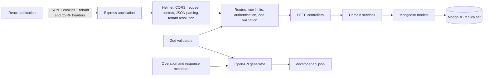
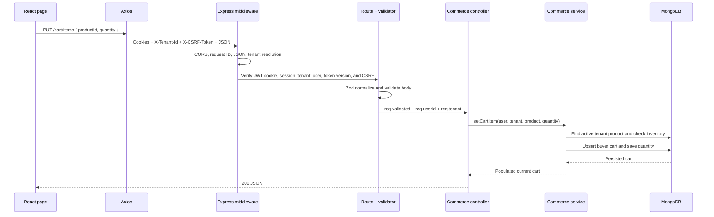
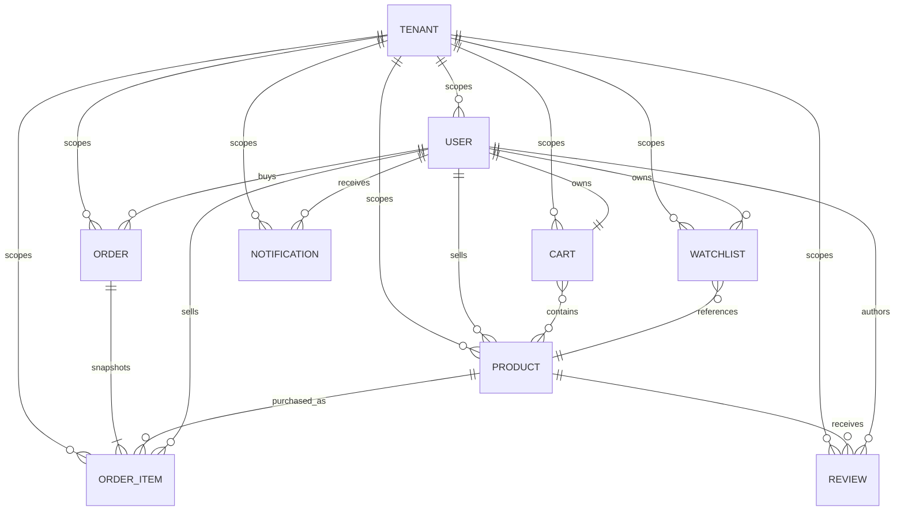

# MercadoZetta Project Overview

## 1. Project purpose and scope

MercadoZetta is an educational white-label marketplace built for INE5612. A
single React frontend and Express API serve two configured brands,
MercadoZetta and CampusMarket, while tenant-owned records share MongoDB and are
isolated by `tenantId`.

The project demonstrates a marketplace's main consistency and authorization
boundaries: catalog discovery, seller-owned listings, buyer state, checkout,
inventory, order fulfillment, reviews, and notifications. It does not model
payments, prices, shipping addresses, refunds, or production deployment. It
should therefore be understood as a development and teaching system rather
than a complete commerce platform.

Practical installation, environment variables, commands, smoke testing, and
troubleshooting belong in the [README](../README.md). Implementation status,
priorities, and session handoff belong only in the
[improvement plan](../PROJECT_IMPROVEMENT_PLAN.md).

## 2. Functional capabilities

### Public workflows

- Browse a tenant-branded product catalog and product details.
- Search names and descriptions; filter by category, subcategory, seller,
  availability, and product status; sort by creation time, name, or inventory.
- View public seller profiles and seller-specific product lists.
- Read product reviews, register an account, and log in.

### Authenticated buyer workflows

- Maintain one persistent cart and a persistent watchlist within a tenant.
- Add, remove, and change cart quantities subject to current inventory.
- Convert the cart into an order through a MongoDB transaction.
- View owned orders and status history, and cancel orders in permitted states.
- Create or update one review per purchased product; sellers cannot review
  their own products.
- View notifications, read the unread count, and toggle read state.

### Authenticated seller workflows

- Create a listing owned by the authenticated user.
- View only the line items they sold, even when an order contains products from
  several sellers.
- Move orders through `placed → confirmed → shipped → delivered` one step at a
  time.
- Receive notifications for new orders and reviews.

The `/admin` frontend route is also authenticated, but it displays tenant
catalog totals and the current user's notifications. There is no administrator
role or privileged backend API, and its product-derived “audit log” is not an
audit trail. The route name must not be interpreted as an authorization claim.

### Engineering workflows

- Repeatable, non-destructive demo data for both configured tenants.
- Focused backend and frontend tests, contract tests, workflow tests, coverage
  thresholds, and database-backed integration tests.
- Generated OpenAPI 3.1 output with deterministic and route-parity checks.
- TypeScript, ESLint, Prettier, dependency audits, Git hooks, and CI.

## 3. System architecture

The browser chooses a checked-in brand using `VITE_TENANT_ID`. The brand
provider applies identity, copy, colors, title, and favicon; the shared Axios
instance sends credentials, adds the corresponding tenant header, and adds the
CSRF proof to mutations. Branding does not establish authority.

The Express middleware order is significant: Helmet and CORS run first,
request context assigns a correlation ID, JSON parsing runs before global
tenant resolution, and routes then apply endpoint-specific authentication,
rate limiting, and validation. Controllers translate HTTP inputs and outputs.
Services enforce business rules and issue tenant-scoped model operations. A
final error handler turns known `AppError` values and malformed JSON into
stable JSON errors and hides unexpected details behind a generic 500 response.

MongoDB is the only external runtime dependency represented in the repository.
No payment, email, object-storage, queue, cache, or third-party identity system
is integrated.

## 4. Repository structure

- `backend/src/routes.ts` defines the implemented HTTP surface and middleware
  sequence for each endpoint.
- `backend/src/controller/` contains thin Express request/response adapters.
- `backend/src/services/` owns authentication, tenant/ownership checks,
  persistence workflows, inventory rules, and lifecycle transitions.
- `backend/src/model/` contains Mongoose schemas, relationships, and indexes.
- `backend/src/validators/` owns request normalization and constraints through
  Zod schemas.
- `backend/src/middleware/` contains global and route-specific transport
  concerns such as tenant resolution, JWT verification, validation, request
  IDs, rate limiting, and error translation.
- `backend/src/openapi/` combines operation and response metadata with request
  schemas to generate the external contract.
- `backend/test/` contains focused unit/contract tests and separate real-
  database integration tests.
- `frontend/src/App.tsx` composes the router and shared authenticated-route
  guard; `frontend/src/routes.ts` centralizes application and API paths.
- `frontend/src/pages/` owns route-level UI and local request state;
  `frontend/src/services/` owns shared HTTP configuration.
- `frontend/src/brands/` defines typed tenant identity, feature flags, and
  reusable marketplace copy.
- `docs/` contains this overview, the detailed authentication flow, and the
  generated OpenAPI document.

## 5. Request lifecycle

A representative authenticated cart update follows this path:

Validation writes normalized values to `req.validated`; controllers should not
re-read untrusted request data when a validated value exists. Authentication
sets `req.userId` only after signature, required claims, tenant match, and the
database token version all pass. Service queries repeat tenant and ownership
constraints because transport middleware alone cannot enforce domain access.

Known domain failures use `AppError` with an HTTP status, stable code, and
user-visible message. Validation errors use the same error shape and may add
details. Unexpected errors become `{ "error": "Internal server error",
"code": "INTERNAL_SERVER_ERROR" }` without exposing internals.

## 6. Domain model

`TENANT` is conceptual: the two tenants are application configuration, not a
MongoDB model. Every persistent marketplace record carries a tenant ID.

- A user is unique by tenant and email. Passwords are bcrypt hashes and
  `tokenVersion` supports all-token logout revocation.
- A product belongs to one seller and records descriptive fields, inventory,
  image URL, and a lifecycle status. The current system has no price field.
- A tenant/user has at most one cart. Cart lines reference products and store
  current quantities; they are not historical records.
- Watchlist records uniquely connect one tenant, user, and product.
- An order belongs to a buyer and stores its current status and actor/timestamp
  history.
- Order items connect an order, product, and seller and snapshot the product
  name and quantity. This allows seller-scoped order views and preserves the
  purchased name even if the product later changes.
- A review is unique per tenant/product/author and can be updated through an
  upsert after purchase eligibility is established.
- Notifications are user-owned messages with a read flag. They are persisted
  but have no delivery channel or retention policy.

Compound indexes reinforce common tenant/owner lookup boundaries. They are not
a substitute for including `tenantId` in each service query.

## 7. Authentication and authorization

Login looks up an email within the resolved tenant, checks the bcrypt password,
creates a tenant/user-scoped session, sets access, rotating refresh, and CSRF
cookies, and returns only public user/session data. The React frontend keeps the public user profile
only in memory, and restores it through `GET /auth/session`.

Protected requests accept only the cookie access JWT,
verify its signature and claims, require the token tenant to match the resolved
request tenant, and confirm the user and revocation version in MongoDB. Cookie
tokens additionally require an active matching session. Logout increments the
user's token version and revokes all server sessions; current and individually
owned sessions can also be revoked. Cookie-authenticated mutations require an
allowed Origin and signed double-submit CSRF proof. The frontend clears its
in-memory identity even if logout fails.

Authorization has two layers:

- The frontend's shared route guard redirects anonymous users and preserves the
  requested destination through login. It is a usability boundary only.
- Backend services scope data by tenant and user and enforce seller, buyer,
  ownership, review, and transition rules. This is the security boundary.

The tenant header is also not proof of access: it selects one of the configured
tenants and must agree with a protected token. Public data is intentionally
tenant-scoped but public within that tenant.

The browser transport now follows the cookie/session contract, including
credentialed requests, in-memory bootstrap, hashed rotation, replay detection,
CSRF checks, bounded renewal, and revocation. JWT signing, refresh hashing, and
CSRF proofs use configured active/previous key rings with explicit versions.
Authorization headers are not an authentication transport. Detailed
mechanics belong in
[authentication-flow.md](authentication-flow.md); the accepted contract is
[ADR 0001](decisions/0001-cookie-sessions.md), and its implementation order is
tracked in the [improvement plan](../PROJECT_IMPROVEMENT_PLAN.md).

## 8. Commerce consistency

Checkout is authoritative on the backend. The service starts a Mongoose session
and transaction, loads the user's tenant cart, and rejects an empty cart. It
then loads all referenced tenant products and rejects missing, inactive, or
understocked items.

Within the same transaction it:

1. creates the order with `placed` status and its first history event;
2. inserts order-item snapshots;
3. conditionally decrements each product only if it remains active and has
   sufficient inventory;
4. clears the cart; and
5. creates buyer and distinct-seller notifications.

Any failure aborts all of these writes. The conditional decrement protects
against stock changing after the initial read. Checkout is not idempotent, so a
client must not assume retrying an uncertain request cannot create a second
order.

Sellers can advance an order exactly one configured step through confirmation,
shipping, and delivery. Buyers can cancel only `placed` or `confirmed` orders.
Every accepted change appends actor and timestamp history and notifies the
buyer. Cancellation does not currently restore inventory.

A review requires any previous order item for the product by the buyer; the
code does not require that order to be delivered or exclude a cancelled order.
The seller cannot review their own product. A later review submission updates
the existing tenant/product/author record.

## 9. Frontend architecture

`App.tsx` defines route composition and wraps protected pages in one shared
guard backed by `AuthProvider`. Route patterns and API paths are centralized in
`routes.ts`; pages should not introduce endpoint strings. The Axios service owns
the base URL, credential transport, tenant and CSRF headers, and bounded
automatic renewal.

Pages currently own remote data through `useState` and `useEffect`. Commerce
mutations show pending, success, and failure feedback, disable conflicting
actions while pending, and generally update local state only after the API
succeeds. There is no centralized server-state cache.

The brand provider selects a typed checked-in configuration, updates document
identity and CSS variables, and supplies tenant-specific copy. Both current
brands inherit the same feature flags; several commerce flags are currently
`false` even though routes and controls implement those capabilities, so those
flags must not be treated as an authoritative capability registry.

The current frontend route surface includes the catalog, seller product and
profile pages, product detail, login, registration, product creation, checkout,
seller orders, and the ambiguously named authenticated `/admin` dashboard.

## 10. API contract and validation

Zod 4 schemas in `backend/src/validators/` are the source of truth for request
normalization, constraints, defaults, and request-side OpenAPI schemas.
`backend/src/openapi/document.ts` supplies operation and response metadata.
Together they generate [openapi.json](openapi.json).

The generated file is an external reference, not an editing surface. After a
route, validator, security requirement, schema, response, or example changes,
run the generation command documented in the [README](../README.md#api-contract).
The OpenAPI contract test checks deterministic file parity, parity between
implemented and documented methods/paths, and required examples.

List responses currently use bare arrays rather than a common envelope, and
list endpoints are unpaginated. Frontend pages also declare local approximate
response types rather than consuming generated or shared contract types.

## 11. Local development

The recommended setup runs the two Node development servers on the host and
MongoDB as a single-node replica set in Docker. The repository also provides a
complete development Compose stack and repeatable seed. See the
[README quick start](../README.md#quick-start) for instructions and
[configuration](../README.md#configuration) for every supported environment
variable.

## 12. Testing and quality controls

The testing strategy separates concerns by what each layer can establish:

- Backend focused tests exercise validators, middleware, controllers, services,
  models, and HTTP behavior with Vitest and Supertest.
- Contract tests detect stale OpenAPI output, route divergence, error-shape
  regressions, and selected cross-layer assumptions.
- Database integration tests run the real application and Mongoose models
  against an ephemeral MongoDB 7 replica set. They cover transactions,
  rollback, persistence, indexes, tenant isolation, authorization, logout
  revocation, and seed repeatability that mocks cannot prove.
- Frontend focused and workflow tests use Vitest, jsdom, Testing Library, and
  `jest-dom` to verify routing, forms, HTTP interactions, protected-route
  return, and user-visible mutation states.
- Backend coverage thresholds are 85% for statements, branches, functions, and
  lines; frontend thresholds are 90% for the same measures.

Type-checking, lint, formatting, dependency audit, build, and test commands are
kept in the [README command reference](../README.md#common-commands). The
current CI runs the database integration lane but not coverage or the available
isolated Chromium authentication lane.

## 13. Deployment model

`docker-compose.yml` is a development/demo topology: MongoDB 7 runs as a
single-node replica set, the backend container runs `ts-node-dev`, and the
frontend container exposes Vite's development server. Source and dependencies
are copied into simple Node Alpine images, and containers are not configured as
non-root application users.

There are no production multi-stage images, static frontend server, TLS or
reverse-proxy contract, production health checks in the application
containers, deployment/rollback procedure, or production image smoke test.
The Compose configuration must not be described as a production deployment.

## 14. Operational behavior

- `GET /health` reports process liveness with `{ status: "ok" }`.
- `GET /ready` reports 200 only when Mongoose is connected and otherwise
  reports 503 with MongoDB status.
- Global tenant resolution runs before both probes, so strict tenant-header mode
  requires the header on probe requests.
- Request context accepts an incoming `X-Request-Id` or generates a UUID,
  returns it in the response, and logs JSON containing request ID, method, path,
  status, and duration outside tests.
- Helmet supplies default security headers, CORS checks configured origins, and
  login/registration have in-memory rate limits.
- `SIGINT` and `SIGTERM` stop accepting connections, close the HTTP server,
  close Mongoose, and exit. There is no explicit shutdown deadline or forced
  fallback.

Operational gaps include unstructured application/error logging outside the
request completion record, no metrics or tracing, no append-only audit events,
no distributed rate-limit store, and no documented backup, restore, migration,
or data-retention process.

## 15. Known limitations

- Authentication is cookie-session-only; deployment key rings must retain old
  versions for their documented overlap windows.
- Catalog and seller filtering/sorting load tenant products before processing
  them in application memory; lists are unbounded and unpaginated.
- Product creation exists, but editing, archival/reactivation workflows, and
  dedicated inventory adjustment/history are absent.
- Orders have no price, payment, address, shipment, return, refund, or dispute
  models. Cancellation does not replenish stock.
- Checkout lacks an idempotency key or equivalent duplicate-request protection.
- Review eligibility means “has an order item,” not “has a delivered,
  non-cancelled purchase.”
- The `/admin` route has no role or permission boundary and its displayed log
  is derived UI, not immutable audit data.
- Notifications have no preferences, external delivery, retention, or cleanup.
- Brand capability flags are stale relative to implemented commerce UI.
- Product images are arbitrary stored strings; there is no upload/object
  storage integration or documented host allowlist.
- Browser end-to-end coverage currently exercises authentication only; there
  are no automated accessibility tests.
- Production deployment, migration, retention, backup, and recovery procedures
  are not established.

These are descriptions of verified current behavior, not commitments about
scope or sequence.

## 16. Improvement roadmap

The current priority is production authentication hardening. Its decision
record, backend cookie/session workflow, and frontend browser transport are
implemented and verified through focused, database-backed, and Chromium tests.
The current priority is production deployment, followed by broader browser-level workflow coverage, scalable
catalog contracts, privileged authorization,
theming/accessibility, centralized server state, API consistency,
observability, account recovery, data lifecycle, and later marketplace
features.

The authoritative checklist, sequencing, completed work, and next-session
handoff are maintained only in the
[PROJECT_IMPROVEMENT_PLAN](../PROJECT_IMPROVEMENT_PLAN.md).

## 17. Contribution guidance

- Preserve the backend dependency direction: route → controller → service →
  model. Controllers adapt HTTP; services own business rules and persistence.
- Scope every tenant-owned read and write in the backend. Never rely on the
  tenant header, frontend filtering, route guards, or hidden controls as
  authorization.
- Keep request normalization, validation, defaults, and request OpenAPI schemas
  together in validators. Keep operation/response metadata in the OpenAPI
  document source and regenerate the external file.
- Add application and API paths to `frontend/src/routes.ts` and update its tests
  with route changes.
- Use the shared protected-route mechanism and preserve the requested login
  destination. New privileged behavior also needs backend permissions and
  negative authorization tests.
- Put reusable brand-sensitive marketplace copy in both tenant configurations.
- For commerce mutations, preserve old UI state on failure and expose pending,
  success, and API-error states while disabling conflicting actions.
- Add new focused scenarios to the test associated with the source module.
  Create broad files only for genuine contract, integration, routing, or user
  workflows.
- Consult the relevant document before changing a documented flow. Keep setup
  and commands in the README, detailed auth in `authentication-flow.md`,
  generated API shapes in OpenAPI, and roadmap state in the improvement plan.

## 18. Troubleshooting and further reading

Step-by-step fixes belong in the [README troubleshooting section](../README.md#troubleshooting).
When diagnosing a failure, first identify its boundary: tenant resolution runs
globally, authentication may perform a database lookup, checkout requires a
replica set, and browser-only failures often indicate CORS or frontend
environment configuration.

- [README](../README.md): onboarding, configuration, commands, and practical
  troubleshooting
- [Authentication flow](authentication-flow.md): token, tenant, logout, and
  protected-route mechanics
- [Generated OpenAPI contract](openapi.json): request and response reference
- [Improvement plan](../PROJECT_IMPROVEMENT_PLAN.md): current priority, planned
  sequence, implementation status, and handoff
